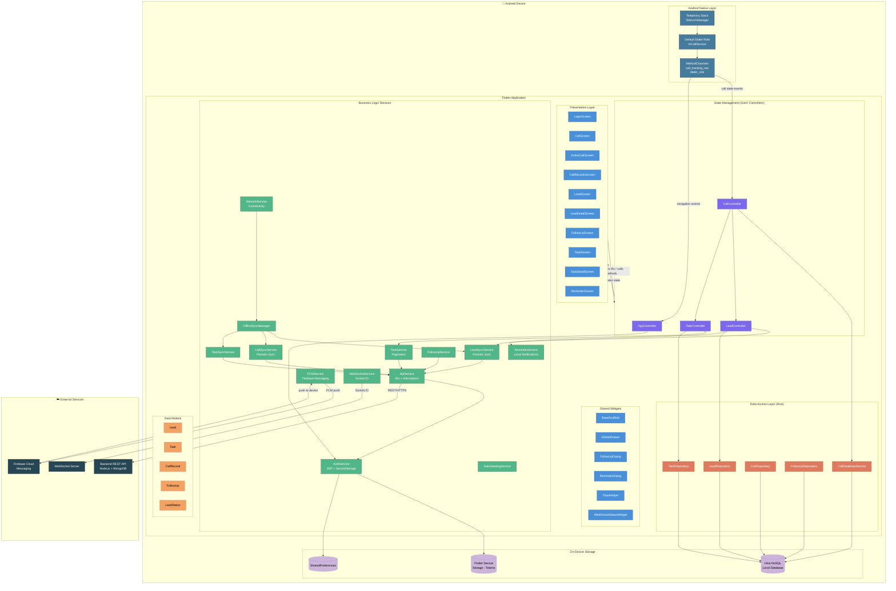
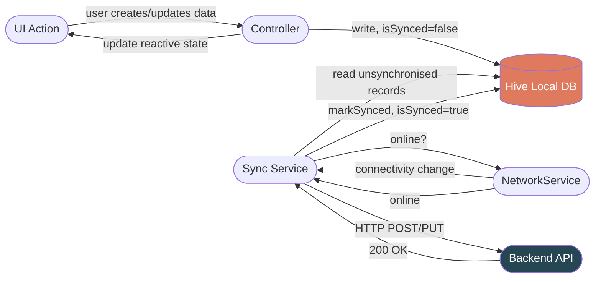

# Architecture Diagram – Call Manager Mobile

> Component/layer view of the application rendered with [Mermaid](https://mermaid.js.org/).

## High-Level Component Diagram



---

## Dependency Injection Map

```mermaid
graph LR
    subgraph Startup["main() – Eager Registration"]
        NW[NetworkService]
        API[ApiService]
        AUTH[AuthService]
        WS[WebSocketService]
        TS2[TaskService]
        TSS2[TaskSyncService]
        CSS2[CallSyncService]
        LSS2[LeadSyncService]
        FUS3[FollowUpService]
        CC2[CallController]
        LC2[LeadController]
        TC2[TaskController]
        AppC[AppController]
    end

    subgraph RouteBindings["Route Bindings – Lazy Registration"]
        subgraph AppBinding["AppBinding"]
            AB_AC[AppController]
        end
        subgraph LeadBinding["LeadBinding"]
            LB_LC[LeadController]
        end
        subgraph CallBinding["CallBinding"]
            CB_CC[CallController]
        end
        subgraph TaskBinding["TaskBinding"]
            TB_TC[TaskController]
        end
    end

    subgraph Routes["Route Activation"]
        R_Login[/login]
        R_Leads[/leads]
        R_Lead[/leadDetail]
        R_Call[/call]
        R_Tasks[/tasks]
        R_Task[/taskDetail]
        R_FollowUp[/followUps]
    end

    R_Login -.->|uses| AppBinding
    R_Leads -.->|uses| LeadBinding
    R_Lead -.->|uses| LeadBinding
    R_Call -.->|uses| CallBinding
    R_Tasks -.->|uses| TaskBinding
    R_Task -.->|uses| CallBinding
    R_FollowUp -.->|uses| LeadBinding
```

---

## Offline-First Data Flow


