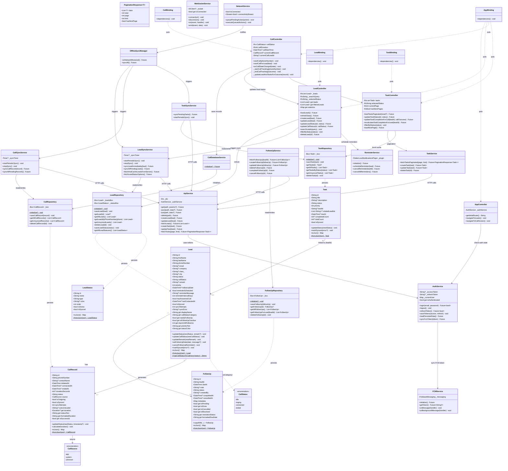

# UML Class Diagram – Call Manager Mobile

> Rendered with [Mermaid](https://mermaid.js.org/). GitHub renders Mermaid diagrams natively in Markdown files.

```mermaid
classDiagram
    %% ─────────────────────────────────────────
    %% MODELS
    %% ─────────────────────────────────────────
    class Lead {
        +String id
        +String firstName
        +String lastName
        +String phoneNumber
        +String? email
        +String? company
        +String? class_
        +String? city
        +String status
        +String callStatus
        +String? remark
        +int priority
        +DateTime? followUpDate
        +bool reminderScheduled
        +String? reminderMessage
        +int reminderIntervalDays
        +bool hasAnsweredCall
        +DateTime? lastContactedAt
        +bool isSynced
        +int syncAttempts
        +String? syncError
        +String get displayName
        +String get callStatusCategory
        +bool get needsFollowUp
        +bool get isFollowUpOverdue
        +int get daysUntilFollowUp
        +String get priorityText
        +String get statusColor
        +updateStatus(newStatus, remark?) void
        +updateCallStatus(newCallStatus) void
        +updateRemark(newRemark) void
        +setFollowUpDate(date, message?) void
        +cancelFollowUpReminder() void
        +markSynced(error?) void
        +toJson() Map
        +fromJson(json)$ Lead
        +mapCallStatusToCategory(status)$ String
    }

    class LeadStatus {
        +String id
        +String name
        +String type
        +String? color
        +int order
        +bool isActive
        +bool isSynced
        +toJson() Map
        +fromJson(json)$ LeadStatus
    }

    class Task {
        +String id
        +String title
        +String? description
        +String status
        +int priority
        +String? leadId
        +List~String~? relatedLeadIds
        +DateTime? dueAt
        +int? completedCount
        +int? totalCount
        +bool isSynced
        +updateStatus(newStatus) void
        +markSynced(error?) void
        +toJson() Map
        +fromJson(json)$ Task
    }

    class CallRecord {
        +String id
        +String phoneNumber
        +String? contactName
        +DateTime initiatedAt
        +DateTime? connectedAt
        +DateTime? endedAt
        +int? durationSeconds
        +String status
        +CallSource source
        +bool isOutgoing
        +bool isSynced
        +int syncAttempts
        +String? outcomeLabel
        +Duration? get duration
        +String get statusText
        +String get formattedDuration
        +bool get isSuccessful
        +updateStatus(newStatus, timestamp?) void
        +calculateDuration() void
        +toJson() Map
        +fromJson(json)$ CallRecord
    }

    class CallSource {
        <<enumeration>>
        app
        system
        unknown
    }

    class CallStatus {
        <<enumeration>>
        idle
        ringing
        connected
        ended
    }

    class FollowUp {
        +String id
        +String leadId
        +DateTime dueAt
        +String? note
        +String status
        +String? createdBy
        +DateTime? completedAt
        +DateTime? cancelledAt
        +Map metadata
        +bool get isPending
        +bool get isDone
        +bool get isCancelled
        +bool get isResolved
        +String get resolutionStatus
        +String get formattedDueDate
        +copyWith(...) FollowUp
        +toJson() Map
        +fromJson(json)$ FollowUp
    }

    class PaginationResponse~T~ {
        +List~T~ data
        +int total
        +int page
        +int limit
        +bool hasNextPage
    }

    %% ─────────────────────────────────────────
    %% REPOSITORIES
    %% ─────────────────────────────────────────
    class LeadRepository {
        -Box~Lead~ _leadsBox
        -Box~LeadStatus~ _statusBox
        +initialize()$ void
        +saveLead(lead) void
        +getLead(id) Lead?
        +getAllLeads() List~Lead~
        +getLeadsByPhoneNumber(phone) List~Lead~
        +getUnsyncedLeads() List~Lead~
        +deleteLead(id) void
        +saveLeadStatus(status) void
        +getAllLeadStatuses() List~LeadStatus~
    }

    class TaskRepository {
        -Box~Task~ _box
        +initialize()$ void
        +saveTask(task) void
        +getTask(id) Task?
        +getAllTasks() List~Task~
        +getTasksByStatus(status) List~Task~
        +getUnsyncedTasks() List~Task~
        +deleteTask(id) void
    }

    class CallRepository {
        -Box~CallRecord~ _box
        +initialize()$ void
        +saveCallRecord(record) void
        +getAllCallRecords() List~CallRecord~
        +getUnsyncedRecords() List~CallRecord~
        +deleteCallRecord(id) void
    }

    class FollowUpRepository {
        -Box~FollowUp~ _box
        +initialize()$ void
        +saveFollowUp(followUp) void
        +getFollowUp(id) FollowUp?
        +getAllFollowUps() List~FollowUp~
        +getFollowUpsForLead(leadId) List~FollowUp~
        +deleteFollowUp(id) void
    }

    %% ─────────────────────────────────────────
    %% SERVICES
    %% ─────────────────────────────────────────
    class ApiService {
        -Dio _dio
        -AuthService _authService
        +get(path, params?) Future
        +post(path, data?) Future
        +put(path, data?) Future
        +delete(path) Future
        +createLead(lead) Future
        +updateLead(lead) Future
        +fetchLeads() Future~List~Lead~~
        +createTask(task) Future
        +updateTask(task) Future
        +fetchTasks(page, limit) Future~PaginationResponse~Task~~
    }

    class AuthService {
        -String? _accessToken
        -String? _refreshToken
        -Map _currentUser
        +bool get isAuthenticated
        +login(email, password) Future~bool~
        +logout() void
        +refreshToken() Future~bool~
        +saveTokens(access, refresh) void
        +loadPersistedData() Future
        +syncFcmToken(token) Future
    }

    class NetworkService {
        +bool isConnected
        +Stream~bool~ connectivityStream
        +queuePendingAction(action) void
        +executeQueuedActions() void
    }

    class LeadSyncService {
        -Timer? _syncTimer
        +startPeriodicSync() void
        +stopSync() void
        +syncLeadImmediately(lead) Future
        +syncAllPendingLeads() Future
        +fetchAndCacheLeadsFromServer() Future
        +fetchLeadStatusOptions() Future
    }

    class CallSyncService {
        -Timer? _syncTimer
        +startPeriodicSync() void
        +stopSync() void
        +syncCallRecord(record) Future
        +syncAllPendingRecords() Future
    }

    class TaskService {
        +fetchTasksPaginated(page, limit) Future~PaginationResponse~Task~~
        +createTask(task) Future~Task~
        +updateTask(task) Future~Task~
        +deleteTask(id) Future
    }

    class TaskSyncService {
        +syncPendingTasks() Future
        +startPeriodicSync() void
    }

    class FCMService {
        -FirebaseMessaging _messaging
        +initialize() Future
        +getToken() Future~String?~
        +onMessage(handler) void
        +onBackgroundMessage(handler) void
    }

    class ReminderService {
        -FlutterLocalNotificationsPlugin _plugin
        +initialize() Future
        +scheduleReminder(lead) Future
        +cancelReminder(leadId) Future
        +cancelAllReminders() Future
    }

    class WebSocketService {
        -IOClient? _socket
        +connect(url) void
        +disconnect() void
        +on(event, handler) void
        +emit(event, data) void
        +bool get isConnected
    }

    class FollowUpService {
        +fetchFollowUps(leadId) Future~List~FollowUp~~
        +createFollowUp(followUp) Future~FollowUp~
        +updateFollowUp(followUp) Future~FollowUp~
        +deleteFollowUp(id) Future
        +completeFollowUp(id) Future
        +cancelFollowUp(id) Future
    }

    class CallDatabaseService {
        +initialize()$ Future
    }

    class OfflineSyncManager {
        +onNetworkRestored() Future
        +syncAll() Future
    }

    %% ─────────────────────────────────────────
    %% CONTROLLERS
    %% ─────────────────────────────────────────
    class AppController {
        -AuthService _authService
        +getInitialRoute() String
        +navigateToLeads() void
        +navigateToCallScreen() void
    }

    class LeadController {
        -RxList~Lead~ _leads
        -RxString _searchQuery
        -RxString _selectedStatus
        +List~Lead~ get leads
        +List~Lead~ get filteredLeads
        +Map get statistics
        +loadLeads() Future
        +refreshData() Future
        +createLead(lead) Future
        +updateLead(lead) Future
        +updateLeadStatus(id, status) Future
        +updateCallStatus(id, callStatus) Future
        +searchLeads(query) void
        +filterByStatus(status) void
        +deleteLead(id) Future
    }

    class CallController {
        -Rx~CallStatus~ callStatus
        -RxInt callDuration
        -DateTime? callStartTime
        -CallRecord? currentCallRecord
        -String? currentCallLeadId
        +startCall(phoneNumber) void
        +startCallForLead(lead) void
        +onCallStateChanged(state) void
        -_startCallTracking(phoneNumber) void
        -_endCallTracking(outcome) void
        -_updateLeadAndTasksForOutcome(record) void
    }

    class TaskController {
        -RxList~Task~ tasks
        -RxString selectedStatus
        -RxInt currentPage
        -RxBool hasMorePages
        +loadTasksPaginated(reset?) Future
        +updateTaskStatus(id, status) Future
        +updateTaskCompletionForCall(leadId, callOutcome) Future
        +recalculateTaskCompletionForLead(leadId) Future
        +filterByStatus(status) void
        +loadNextPage() Future
    }

    %% ─────────────────────────────────────────
    %% BINDINGS
    %% ─────────────────────────────────────────
    class AppBinding {
        +dependencies() void
    }
    class LeadBinding {
        +dependencies() void
    }
    class CallBinding {
        +dependencies() void
    }
    class TaskBinding {
        +dependencies() void
    }

    %% ─────────────────────────────────────────
    %% RELATIONSHIPS
    %% ─────────────────────────────────────────

    %% Model associations
    Lead "1" --> "0..*" FollowUp : has
    Lead "1" --> "0..*" CallRecord : generates
    Task "0..*" --> "0..1" Lead : linked to (leadId)
    CallRecord --> CallSource : source
    Lead ..> CallStatus : tracks (callStatusCategory)

    %% Repository → Model
    LeadRepository ..> Lead : persists
    LeadRepository ..> LeadStatus : persists
    TaskRepository ..> Task : persists
    CallRepository ..> CallRecord : persists
    FollowUpRepository ..> FollowUp : persists

    %% Service → Repository
    LeadSyncService --> LeadRepository : reads/writes
    CallSyncService --> CallRepository : reads/writes
    TaskSyncService --> TaskRepository : reads/writes
    FollowUpService --> FollowUpRepository : reads/writes
    CallDatabaseService --> CallRepository : initialises

    %% Service → Service
    ApiService --> AuthService : uses tokens
    LeadSyncService --> ApiService : HTTP calls
    CallSyncService --> ApiService : HTTP calls
    TaskService --> ApiService : HTTP calls
    TaskSyncService --> ApiService : HTTP calls
    FollowUpService --> ApiService : HTTP calls
    AuthService --> FCMService : sync FCM token
    OfflineSyncManager --> LeadSyncService : triggers
    OfflineSyncManager --> CallSyncService : triggers
    OfflineSyncManager --> TaskSyncService : triggers
    NetworkService --> OfflineSyncManager : notifies

    %% Controller → Service / Repository
    LeadController --> LeadRepository : CRUD
    LeadController --> LeadSyncService : triggers sync
    LeadController --> ReminderService : schedule reminders
    CallController --> CallDatabaseService : save records
    CallController --> LeadController : updates lead status
    CallController --> TaskController : recalculates tasks
    TaskController --> TaskService : pagination
    TaskController --> TaskRepository : local cache
    AppController --> AuthService : check auth state

    %% Bindings → Controllers
    AppBinding ..> AppController : puts
    AppBinding ..> LeadController : puts
    AppBinding ..> CallController : puts
    AppBinding ..> TaskController : puts
    LeadBinding ..> LeadController : puts
    CallBinding ..> CallController : puts
    TaskBinding ..> TaskController : puts
```
