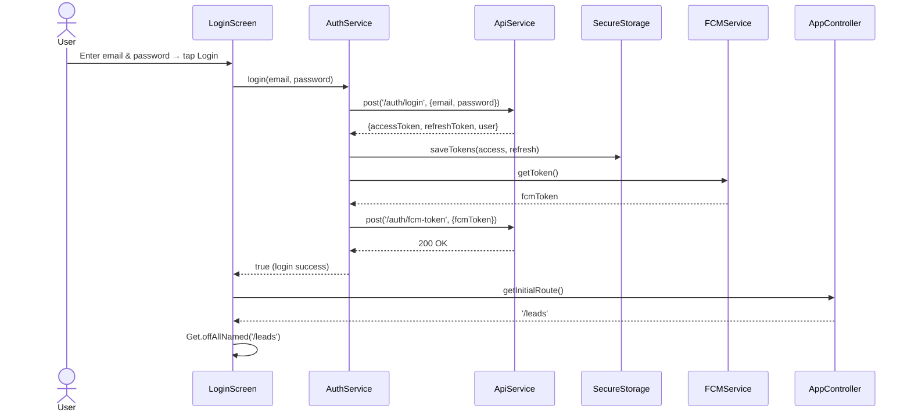
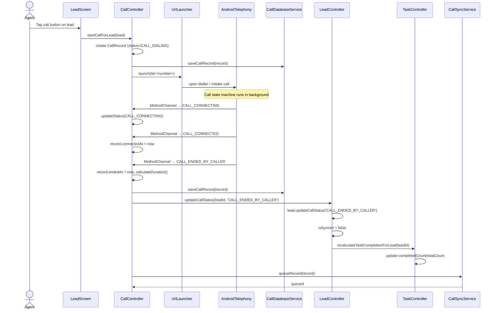
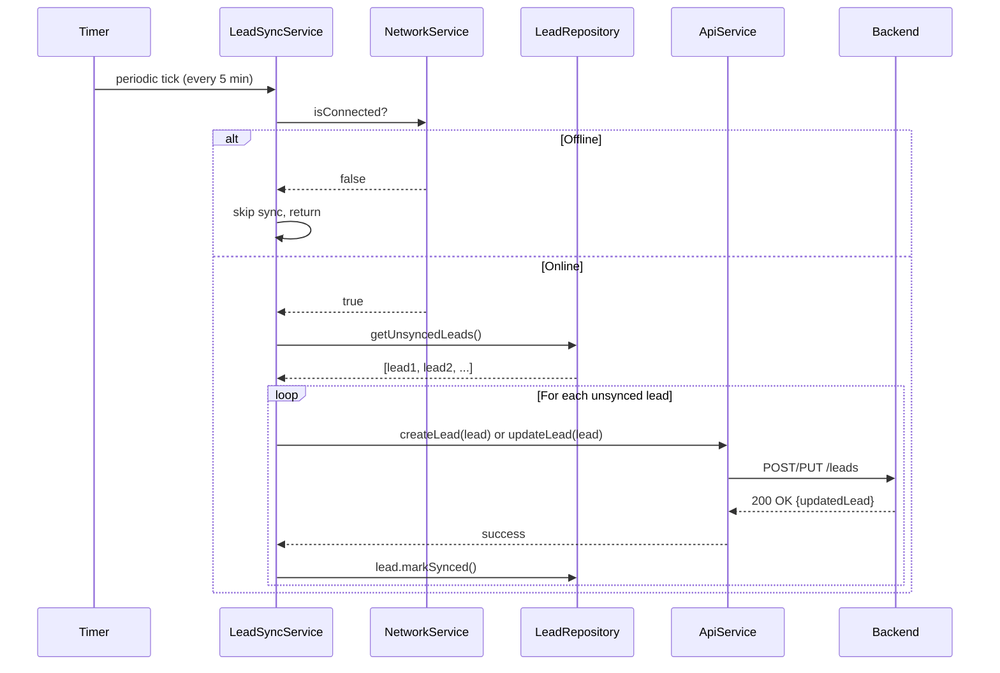
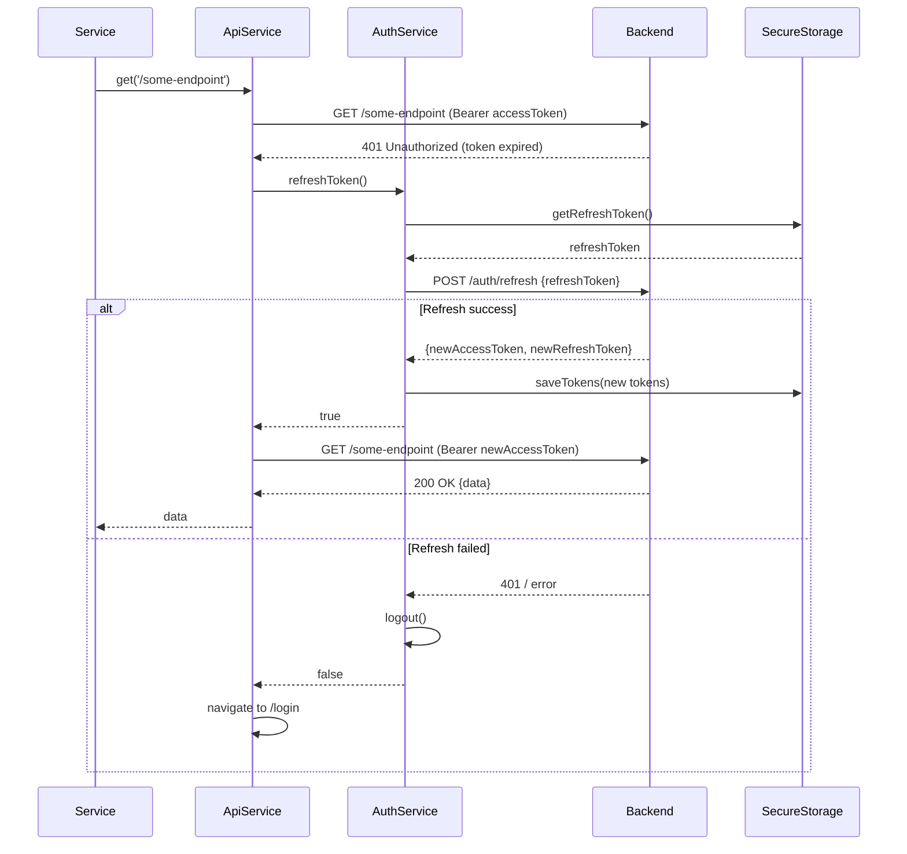
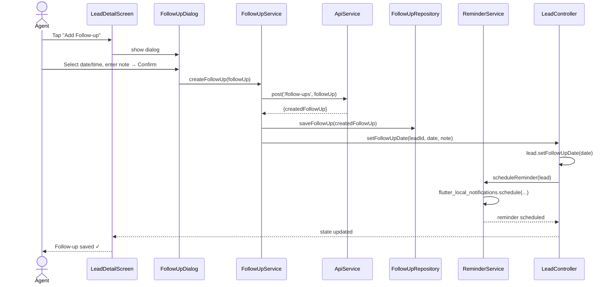
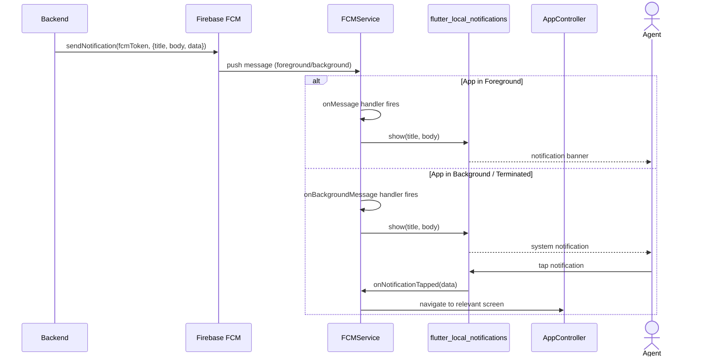
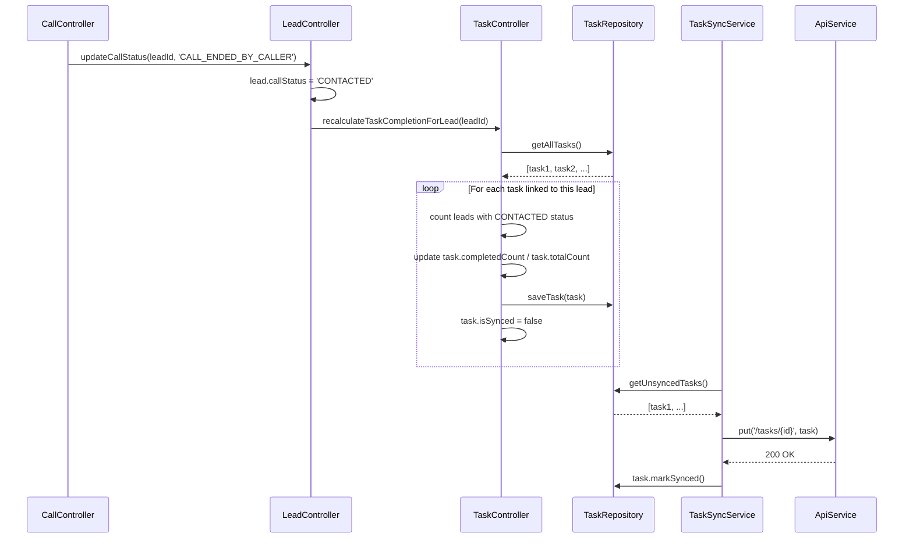

# UML Sequence Diagrams – Call Manager Mobile

> Key runtime interactions rendered with [Mermaid](https://mermaid.js.org/).

---

## 1. User Login Flow

---

## 2. Outbound Call Tracking Flow

---

## 3. Lead Sync (Offline → Online)

---

## 4. JWT Token Refresh Flow

---

## 5. Follow-Up Creation & Reminder Scheduling

---

## 6. FCM Push Notification Handling

---

## 7. Task Completion Recalculation

